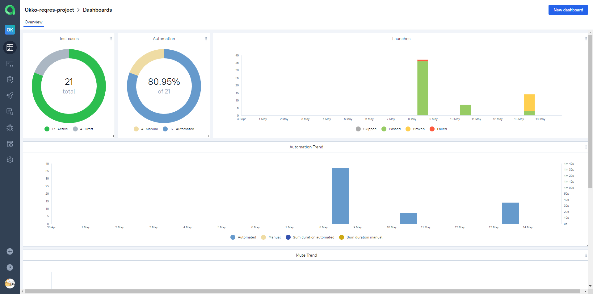

<h1> Проект тестирования сайта и мобильного приложения онлайн-кинотеатра Okko </h1>

> <a target="_blank" href="https://okko.tv/">Okko</a>

<!-- Технологии -->

### Используемые технологии

  <code></code>
  <code></code>
  <code></code>
  <code></code>
  <code></code>
  <code></code>
  <code></code>
  <code></code>
  <code></code>
  <code></code>

<!-- Тест кейсы -->
UI:
* ✅ Проверка доступности вариантов регистрации
* ✅ Регистрация пользователя с корректным email
* ✅ Регистрация пользователя с некорректным email
* ✅ Переход в выбранный раздел сайта
* ✅ Поиск фильма по названию
* ✅ Выбор фильмов по определенной категории
* ✅ Выбор фильмв по определенному жанру

Mobile:
* ✅ Регистрация пользователя через email
* ✅ Поиск фильма по названию
* ✅ Покупка фильма  

<!-- Jenkins -->

###  Запуск проекта в Jenkins

### [Задача в jenkins](https://jenkins.autotests.cloud/job/KirErmakov_Diplom_project)

<!-- Allure report -->

###  Allure report

##### Результаты выполнения тестова можно посмотреть в Allure-отчете

##### Видео прохождение теста (Регистрация пользователя)

<!-- Allure TestOps -->

###  Интеграция с Allure TestOps

### [Dashboard](https://allure.autotests.cloud/project/4221/dashboards)

<!-- Jira -->

###  Интеграция с Jira

<!-- Telegram -->

###  Интеграция с Telegram
##### После выполнения тестов, в Telegram bot приходит сообщение с графиком и информацией о тестовом прогоне.

